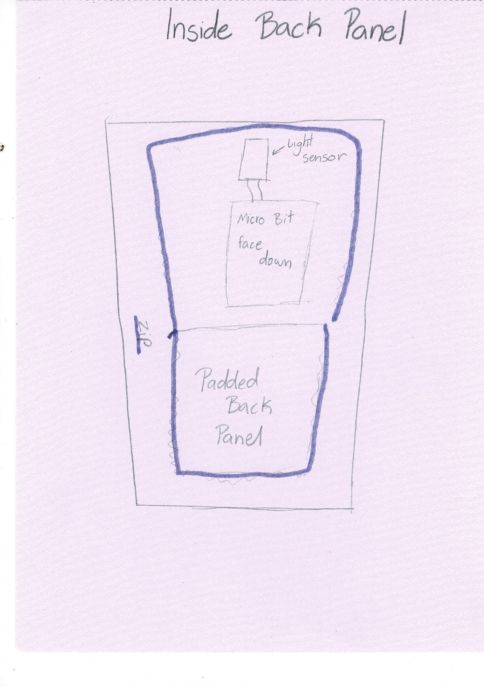
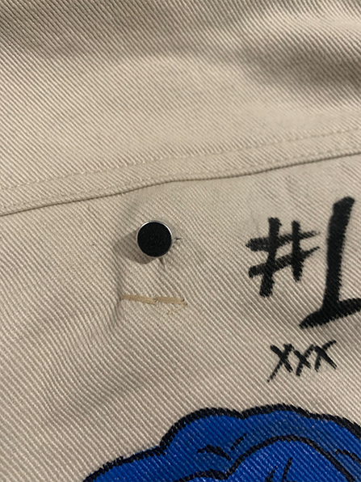
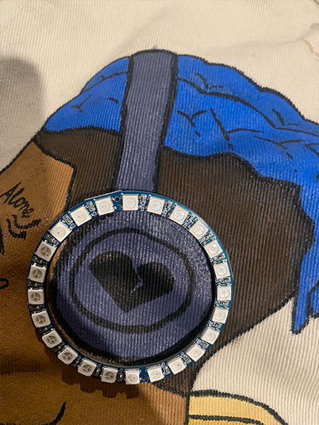

# 1701QCA Final project journal: *Denim Jacket with LED's that respond to sound*
<video src="LED Jacket video.mp4" width="512" height="288" controls preload></video>

<!--- As for other assessments, fill out the following journal sections with information relevant to your project. --->

<!--- Markdown reference: https://guides.github.com/features/mastering-markdown/ --->

## Related projects ##
<!--- Find about 6 related projects to the project you choose. A project might be related through  function, technology, materials, fabrication, concept, or code. Don't forget to place an image of the related project in the appropriate folder and insert the filename in the appropriate places below. Copy the markdown block of code below for each project you are showing. --->
LED Technology at The Met Gala

https://medium.com/@harishpersad/led-technology-at-the-met-gala-cd610c729d22

This is Zendaya’s MET Gala look. It is a Cinderella dress designed by Law Roach that incorporates an LED solution for fabric colour changing in a daylight red carpet setting. This project is related to mine as I am also creating clothing with led lights. Instead of responding to light levels I am creating a jacket that responds to sound.  My aim is to create a more accessible version and incorporate sound.

### Related project 2 ###
Audiolux

[Audiolux](http://audioluxdevices.webflow.io/how-it-works)

This project is a device that allows users to translate sound to light! This plug-and-play stomp box analyses audio in real-time & generates music visualizations for smart LED pixels. This is similar to my project as I its LED’s that responds to sound. My aim is to incorporate something similar in a denim jacket.

### Related project 3 ###
Printer Farm Status Jacket 

[instructables] (https://www.instructables.com/id/3D-Printer-Status-Jacket/)

This project is a fun way to display the status of all of your machines, to ensure the printers keep printing! This build uses a Particle Photon for its IoT capabilities, and Adafruit NeoPixels. This is similar to my project as it is wearable LED’s and that is another form of wearable tec.

### Related project 4 ###
Trucker Jacket Levi’s 

[jacquard] (https://atap.google.com/jacquard/collaborations/levi-trucker/)

This project is a Iconic Levi’s Trucker jacket merges style with innovative Jacquard technology. Answer calls, play music, and take photos right from your sleeve. This is similar to my project as it is a jacket with technology embedded in it.
### Related Project 5 ###

<!--- Modify code to insert image of related project below --->

<!--- Fill out name and link to related project in the code below. --->
[Eye of the Storm](https://amy0251.wixsite.com/mysite/copy-of-thunderstorm-1)

Sound Reactive Dress. Made with bespoke holographic leather and sound-reactive, animated electroluminescent panels, as the volume rises, the dress illuminates to create ‘visual music’. Rainbow Winters, 2009. This project is simmilar to mine as it fashon inspired by music.
<!--- Include information about why this project is related to yours. --->

<!--- Repeat code above for a total of 6 related projects --->

## Other research ##
<!--- Include here any other relevant research you have done. This might include identifying readings, tutorials, videos, technical documents, or other resources that have been helpful. For each particular source, add a comment or two about why it is relevant or what you have taken from it. You should include a reference or link to each of these resources. --->
[mashable] (https://mashable.com/2016/02/11/led-clothes/)

This source is an article on the future of LED clothes. The article talks about different designers that are incorporating LED’s into their clothing, and briefly talks about the process of make the clothing and how to works. This gave me some ideas on how I could do my project. For example, the article says many designers use silhouettes popular in street like oversized and minimal this not only helps the aesthetic value of the project it will also help to hide the Micro Bit. The article also reviews the clothing and highlights some flaws in the design. This shows me what to avoid doing. 

[howstuffworks] (https://electronics.howstuffworks.com/gadgets/high-tech-gadgets/fabric-display4.htm)

This article is similar to the previous one. This article goes more in-depth with the process of creating the clothing. This gave me inspiration on how I could do that. 

[YouTube](https://www.youtube.com/watch?v=6ZjLd2ifxhY)
[YouTube](https://www.youtube.com/watch?v=tPxFe_rETHA)
[YouTube](https://www.youtube.com/watch?v=guZJT_h2gP0)

the three video are tutorial on how to make sound and voice reactive LED’s using Arduino. Although this was made for thee Arduino, I could adapt it work with the micro bit.  These video helped me get an idea on how mine should work on the micro bit. The videos also helped me get an idea of the sound sensor and how to works.

[sparkfun] (https://invent.sparkfun.com/cwists/preview/2054x)

This is a project someone has done that incorporates LED’s into a cape using a micro bit. What I have taken from this article is how to incorporate the LED’s. They used Lilly Pad LED’s with conductive thread. 

[YouTube] (https://www.youtube.com/watch?v=FxvBVvBWh4I)

This video goes into detail on different sew able LED’s and wearable technology in general. What I took from this video was that Lilly Pad LED’s work really well for wearable LED’s. They are waterproof but can be a bit expensive. 

[wearabletutorials] (https://www.wearabletutorials.com/making_leds_sewable_for_wearables_conductive_thread/)
 
This article is about Making LED Lights Sewable for Wearables and Conductive Thread This article. This article will help me make the LED’s I have sewable into the jacket.

[osoyoo] (https://osoyoo.com/2018/09/17/micro-bit-lesson-using-the-sound-detection-sensor/)

This website showed me how to connect the Sound sensor to my micro bit and get it working it also showed a simple code I can use to test if it’s working.

## Conceptual development ##

### Design intent ###
<!--- Include your design intent here. It should be about a 10 word phrase/sentence. --->
The Design intent for my project is to create a jacket that has a design on the back panel that incorporates LED's that resound to sound.

### Design ideation ###
<!--- Document your ideation process. This will include the design concepts presented for assessment 2. You can copy and paste that information here. --->
The Design intent for my project is to create a jacket that has a design on the back panel that incorporates LED's that resound to sound.

### Design concept 1 ###
My first design concept is a soundboard. It would allow to people to record sound and then play and loop them. The soundboard would have laptop connectivity allowing you to save the beat you have made. The soundboard would have a strip going down the centre and would come with a series to sticks with different coatings. Some have a thinner coating producing a different sound then one with a thick coting.

### Design concept 2 ###
My second design concept is a hat that moves to ward sound. There would be little spikes around the brim of the Hat that move toward where the sound in coming from. There would be a two sensors one on each side of the hat.

### Final design concept ###
<!--- This should be a description of your concept including its context, motivation, or other relevant information you used to decide on this concept. --->
The final design concept is to create jacket that can be warned two parties in clubs. The final design concept is a jacket with LED lights integrated into the back panel that reacts to music, this is done through a sound sensor that’s sticks out of the top of the back panel. This project is inspired by project called “Eye of the Storm, A Thunderstorm Dress. Created by Rainbow Winters X WCPC & NthDegree, this dress has lights in it that respond to the sounds of nature and looks like lightning.

### Interaction flowchart ###
<!--- Include an interaction flowchart of the interaction process in your project. Make sure you think about all the stages of interaction step-by-step. Also make sure that you consider actions a user might take that aren't what you intend in an ideal use case. Insert an image of it below. It might just be a photo of a hand-drawn sketch, not a carefully drawn digital diagram. It just needs to be legible. --->

## Process documentation ##
Week 5
This week we set up groups and discussions boards. I put my area of interest as music, particularly Hip Hop and R&B. I also responded to other people’s areas of interest. 

Week 6
In the Discussion board I up my area of interest as music. I got a suggestion form Cheuk Fai Mak it was “maybe you can make some sick beat that involves people interaction like everyone can modify it and come up with a really good one =D”. I really like this idea I am going to try make a soundboard that allows people to record sound and turn it into a beat. 

Easter Break
I did some research into making a soundboard with the micro bit. I would need to find a speaker to use. In my previous project used earphone speakers but you can’t hear it unless you put it in your ears. I want to incorporate and eternal speaker. I also need to find a way to record the sound. I can use buttons to create the soundboard and I can but everything in a box made of plywood to make it look presentable. I had another idea; it was to make a jacket with lights in the back that react to sound or a hat that moves toward sound but in not sure how that would work. 

Week 7
During tutorial
During the tutorial I talked to Ged about my ideas. He pointed out it need to be something unique so I could have an interesting way of interreacting with the sound bored like physically moving it to get different sounds. I am now thing if doing the jacket idea. I need to do some research into sewable LED lights. I also need to look into sound sensors. 

After Tutorial 
I did some more research into sewable LED lights I found a brand called Lilly Pad LED’s that are really good. They are easy to use and are waterproof the only issue is that they are expensive, and I won’t be able to get them because of the corona virus it will take too long to get here. I did some more research and found that you can bent the normal LED’s to sew them. I need to buy some more LED’s and find connective thread. 

I found it difficult to find any micro bit project with a sound sensor all I could find was Arduino. I emailed Ged to see if I could change the project from a sound sensor to a light sensor. The main issue with this was that it doesn’t fit with my area of interest. I sent some Arduino project I wanted to create on the micro bit and he sent be some links. After looking at them I had an idea of what I had to do. I sketched out a design of what I wanted it to look like and how it would work.

I bought a sound sensor it was hard to find. I played with it a bit, I didn’t get it working but I know what I need to do to fix it.

Week 8 
This week I got the sound sensor working. I tried to follow a instructions from This website  (https://osoyoo.com/2018/09/17/micro-bit-lesson-using-the-sound-detection-sensor/). Although the sound sensor was on there was not enough voltage flowing from the micro bit was not sound sensor for it to pick up any sound. To fix this issue I used an NPN and PNP transistor to amplify the voltage. For the code I downloaded a neopixel extensions into the workspace. The code is very simple. Inside the forever block I have a else block. If P1 picks up something the light turn on rainbow. If nothing is picked up it is black (turned off).

Week 9
I a Found issue with original idea for LED’s. There was not enough power from the micro bit for all of my LED’s because I would need over 20 of them and I also struggled to fond connective thread. To fix this issue I went to jay car got a nonpixel circle LED. Because of the circle LED I have to change my design. I created a design that would work with the circle shape. I went through many different ideas, but I settled on painting a side angle XXXtentaction and having the led around his headphones. Another problem I ran into was that the micro bit is very bulky and will not fit in the pocket of my jacket. I need to do some research on how to fix this.

Week 10
After some research I came across veroboards. Veroboard is a brand of stripboard, a pre-formed circuit board material of copper strips on an insulating bonded paper board. I bought a Veroboard and some wires from Jaycar. I sawdered the connections with help from my dad. Then Cut a hole for the sound sensor and sewed it in place.

I cut a small hole at the top of the back pnel of the jacket and pushed the sound sensor through it and sewed it down

 After that I used sawdering iron to heat up a screwdriver and made three holes for the 2 power and one data connection for the neo pixel on my jacket where the LED’s are going. Then I fed the wires through the wholes. Then I sewed the LED into place. 
 

My dad held the jacket down then I using the sawdering iron and made a hole in the pocket and then I connected the sound sensor and the led to the micro bit using the wires I got from jaycar finishing the circuit. I fed the wires through the hole.
. So now it sits nicely in the pocket. Then I did a test run to make sure it was working. It works the only issue is it is not that sensitive and the music need to be loud, but this jacket it make to be worn at parties and clubs where the music is loud. I’m going to try to see if increasing the amount of power will make it more sensitive. 

During the tutorial I showed a video of it working. I also talked to Ged and he said to be careful adding more power I could end up frying the micro bit and to try switching from digital pin to antilog. So, I’m going to try it.

 Week 11
Added detail to my journal and the written work. I wrote my journal in word to I copied everything over.

Week 12
I asked my cousin and my friend to model the jacket I took a bunch of shot of it and the inside to show how it works. The video needs to be at least a minute long, so I took some shots of them just wearing the jacket to show off the design. Then I got some shots of the wearing and sensor in the back and the micro bit in pocket. I started editing the video in premier pro. I started with some clips I took of my cousin I added collage text of different fonts and sizes saying denim jacket, then wrote with LED’s that resound to sound. I recorded the clip of the jacket working. Then I added music. I made it so that the clips change of beat. I then used an opacity mask to make it look like it look like the clip go through the headphones into the other one. Then I added text and the end slide with a video of xxxtentacion and text saying by Bhagya Binushi Jayatialke. I then finished my theory work. I uploaded my video to Youtube, when I loaded my video the quality of the video went down but I attached the video to my assignment so full quality one is still accessible. 

## Final code ##

<!--- Include here screenshots of the final code you used in the project if it is done with block coding. If you have used javascript, micropython, C, or other code, include it as text formatted as code using a series of three backticks ` before and after the code block. See https://guides.github.com/features/mastering-markdown/ for more information about that formatting. --->

let strip = neopixel.create(DigitalPin.P0, 24, NeoPixelMode.RGB)
basic.forever(function () {
    if (pins.digitalReadPin(DigitalPin.P1) == 1) {
        strip.showRainbow(1, 360)
    } else {
        strip.showColor(neopixel.colors(NeoPixelColors.Black))
    }
})

## Design process discussion ##
<!--- Discuss your process used in this project, particularly with reference to aspects of the Double Diamond design methodology or other relevant design process. --->

## Reflection ##

<!--- Describe the parts of your project you felt were most successful and the parts that could have done with improvement, whether in terms of outcome, process, or understanding.

What techniques, approaches, skills, or information did you find useful from other sources (such as the related projects you identified earlier)?

What parts of your project do you feel are novel? This is IMPORTANT to help justify a key component of the assessment rubric.

What might be an interesting extension of this project? In what other contexts might this project be used? --->
